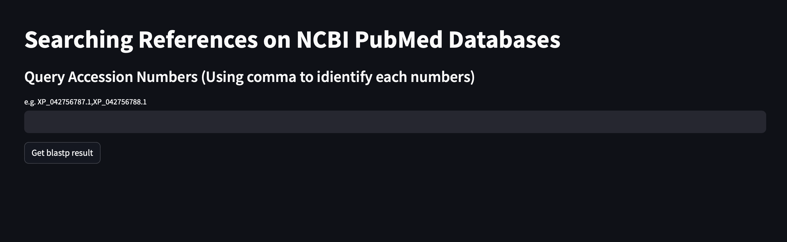
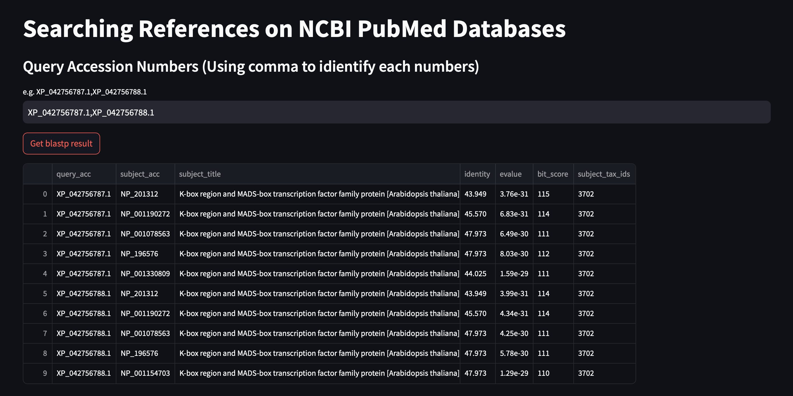
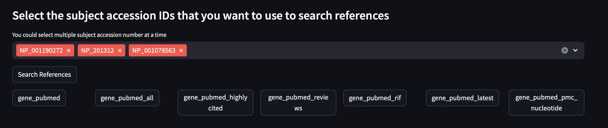
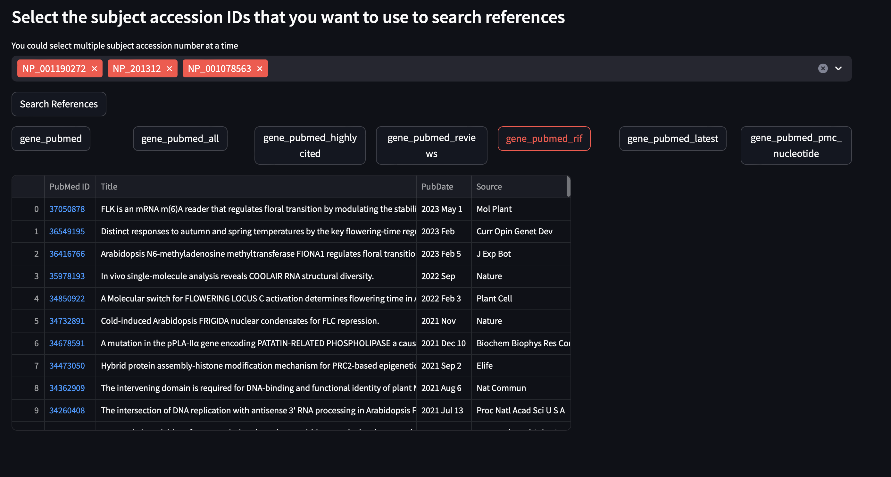
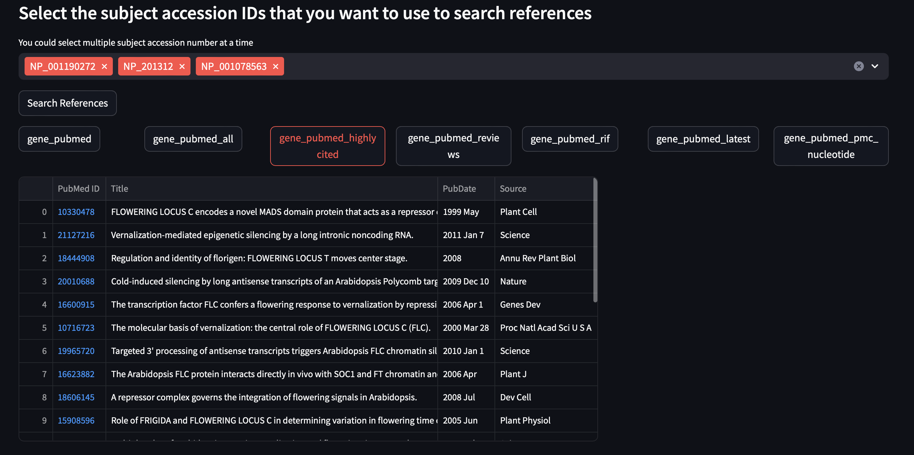

# CDS_annotation_references_app
This is an samll tools of [CDS_datamining_annotation project](https://github.com/Hsin-Ping/CDS_datamining_annotation) based on [streamlit](https://streamlit.io) library. It builds a search engine based on the blastp result generated by CDS_datamining_annotation and search references with [NCBI ENTREZ system](https://www.ncbi.nlm.nih.gov/books/NBK3837/), you could search any query gene in particular dataset stored in your SQLite. This tools will showed the blasp result first, then you can select several subject genes at a time and search their references on different linked databases from [Gene database](https://www.ncbi.nlm.nih.gov/gene) to [PubMed database](https://pubmed.ncbi.nlm.nih.gov).
# Tutorial
- **Step1. Modify config.ini: change **sql** parameter in **path** section and **sheet_name** in **param** section to your SQLite path and the name of target sheet.**
  
- **Step2. Run the app.py to inter HomePage with search engine.**
  </img>
- **Step3. Review Blasp Result of your query genes.**
  - Type the query gene's accession number in the searching bar, then press "show_blastp_result" button. 
  - If you want to search more than one Query gene, seperate each number with comma.
  </img>
- **Step4. Select the subject gene then found the linked databases by pressing the "Search References" button.**
  </img>
- **Step5. Select the desired linked database, then navigate the references you are intersted by click it's **PubMed ID****
  - For the researches who want to search gene function, highly recommend the linked database **gene_pubmed_rif** if available.
 </img>
 </img>
